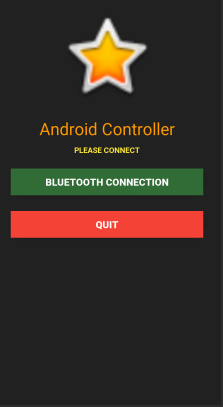
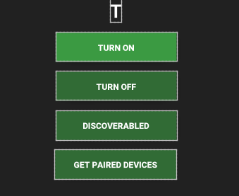
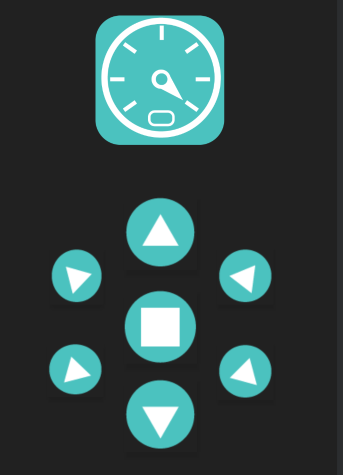

# Remote Control Android App

This Android application allows you to remotely control a device using Bluetooth. It provides a user interface with various buttons for controlling the device's movements.

## Features

- Control the device in different directions: up, down, up-left, up-right, down-left, down-right.
- Apply brakes to stop the device's movement.
- Connect to a Bluetooth device and establish a communication channel.

## Prerequisites

- Android device with Bluetooth capability.
- Bluetooth-enabled device to be controlled.

## Getting Started

1. Clone or download the project from this repository.
2. Import the project into Android Studio.
3. Connect your Android device to your development machine.
4. Build and run the application on your Android device.

## Usage

1. Launch the application on your Android device.
2. Turn on Bluetooth if it's not already enabled.
3. Click on the "Paired Devices" button to view a list of paired Bluetooth devices.

4. Select the desired device from the list.
5. The application will establish a connection with the selected device.
6. The main control interface will be displayed.

7. Use the provided buttons to control the movements of the device.

Note: Make sure the connected device is properly set up to receive commands via Bluetooth.

## Troubleshooting

- If the Bluetooth device is not listed in the paired devices, make sure it is in pairing mode and try again.
- If the device connection fails, ensure that the Bluetooth device is within range and the correct UUID is used for communication.

## Screenshots

1. Controller UI

2. Paired Devices List

3. Main Control Interface

## License

This project is licensed under the MIT License - see the [LICENSE](LICENSE) file for details.
